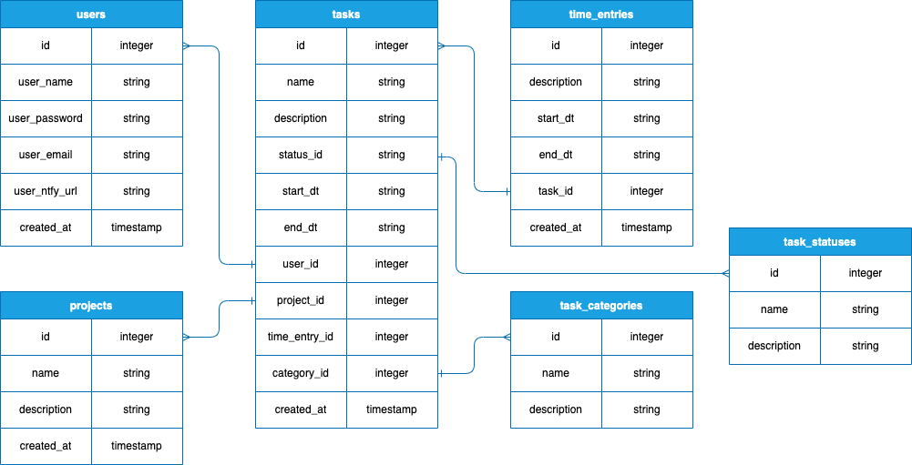
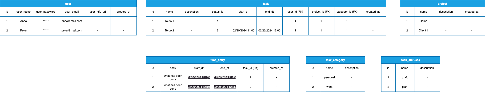
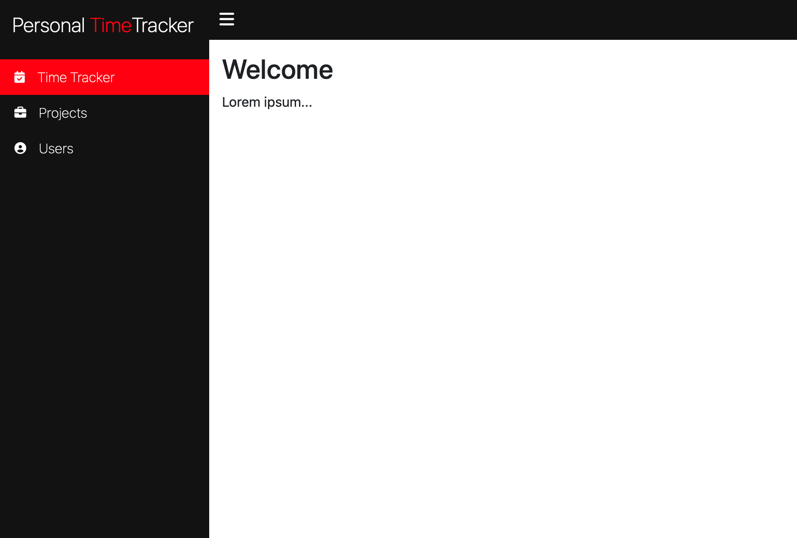
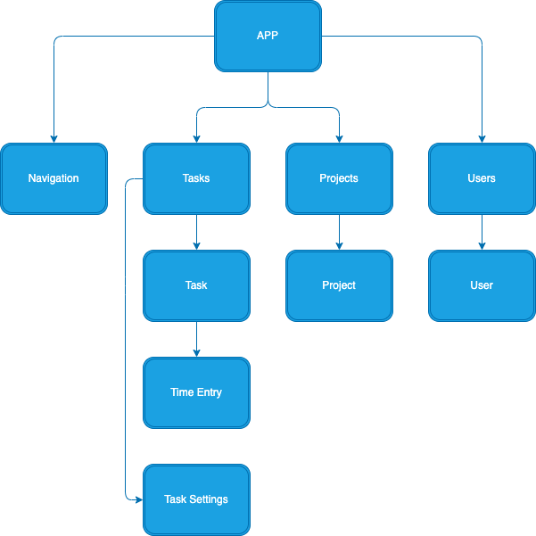

# personal-time-tracker

# PROJECT PITCH
### Project Name: Personal time tracker
### Owner: Igor Rakush

### App description:
Personal time tracker tool designed to help visualize plan/fact time progress.

### CRUD User Story
As a user, I want to be able to create, read, update and delete tasks of my planned and actual time, as well as schedule tasks for other users.


## Installation Instructions
To download the dependencies for the frontend and backend, run:
```
pipenv install
pipenv shell
npm install --prefix client
```
You can run your Flask API on localhost:5555 Links to an external site. by running:
```
python server/app.py
```
You can run your React app on localhost:4000 Links to an external site. by running:
```
npm start --prefix client
```

## BACKEND (Flask)

## Data flow visualizations: 
### ERD Database Table:

The entity relationship database is illustrated here:



### Domain Model



### MODELS
* many-to-many relationship
* A `user` has many `projects` through `tasks`
* A `project` has many `tasks`
* A `project` has many `users` through `tasks`
* A `task` belongs to a `user` and `project`
* A `task` has many `time_entries`
* A `task` has one `task_category`


### VALIDATIONS 
* Add validations to the `User` model:
* - must have a `user_name`, `user_password` and `user_email`
* Add validations to the `Task` model:
* - must have a `name`, `user_id`, `project_id`, `category_id`
* - `start_dt` should be equal to or greater than Today
* Add validations to the `Project` model:
* - must have a `name`
* Add validations to the `Time_Entry` model:
* - must have a `task_id`

## API Routes

**User**
```
GET /user/
POST /user/
```

```
GET /user/<int:id>
PATCH /user/<int:id>
DELETE /user/<int:id>
```

**Project**
```
GET /project/
POST /project/
```

```
GET /project/<int:id>
PATCH /project/<int:id>
DELETE /project/<int:id>
```

**Task**
```
GET /task/
POST /task/
```

```
GET /task/<int:id>
PATCH /task/<int:id>
DELETE /task/<int:id>
```

**Task_Entry**
```
GET /task_entry/
POST /task_entry/
```

```
GET /task_entry/<int:id>
PATCH /task_entry/<int:id>
DELETE /task_entry/<int:id>
```

**Task_Category**
```
GET /task_category/
POST /task_category/
```

```
GET /task_category/<int:id>
PATCH /task_category/<int:id>
DELETE /task_category/<int:id>
```

**Task_Status**
```
GET /task_status/
POST /task_status/
```

```
GET /task_status/<int:id>
PATCH /task_status/<int:id>
DELETE /task_status/<int:id>
```


## FRONTEND (REACT)



## Component Hierarchy


## Component Details

## React Routes
/tasks: The home page displays a list of all plan/fact tasks of the user.

/users: This page displays a list of all users. You can create, edit and delete users on this page.

/projects: The Projects page displays all projects. You can create, edit and delete projects on this page.

### EXTRA!
> Stretch goals:
> - Search :: Add the ability to search by task
> - Notification :: Sending reminders to the user's cell phone about an upcoming task
> - Habits :: Add the ability to keep a record of daily activities
> >